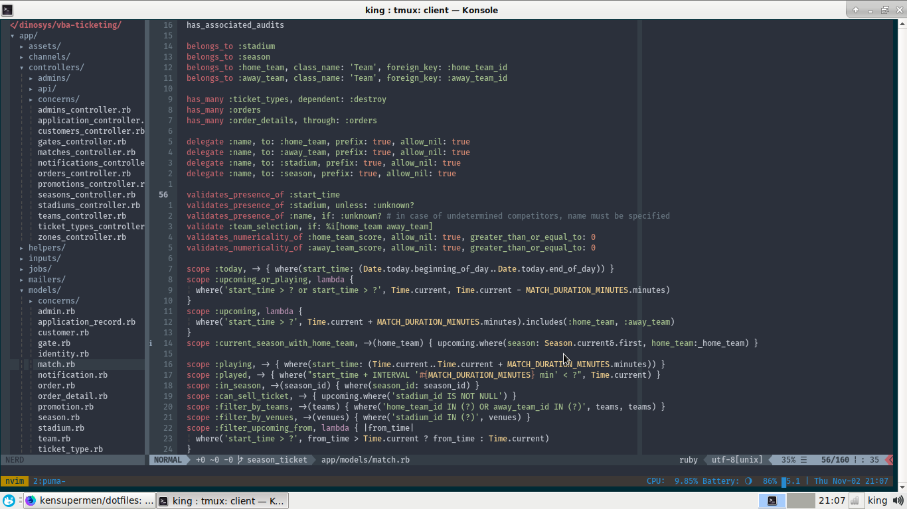

# Config \*Unix (macOS & ArchLinux)

## Screenshot

### MACOS


### ARCH LINUX



## Features

- Ruby/Node version manager: asdf
- Recursively searches: ripgrep
- Shell: fish shell & oh my fish framework
- Text editor: neovim
- Dotfiles manager: stow
- Terminal: WezTerm
- Tiling window manager: Yabai + skhd + sketchybar
- Terminal multiplexer: Tmux

## Install

To set up your development environment, run

```bash
  alias config='/usr/bin/git --git-dir=$HOME/.dotfiles/ --work-tree=$HOME'
  curl -sSL https://raw.githubusercontent.com/th0r/dotfiles/master/.scripts/install.sh | sh
```

## Notes

### Find colorschemes for iterm2

- https://iterm2colorschemes.com/
- https://github.com/MartinSeeler/iterm2-material-design
