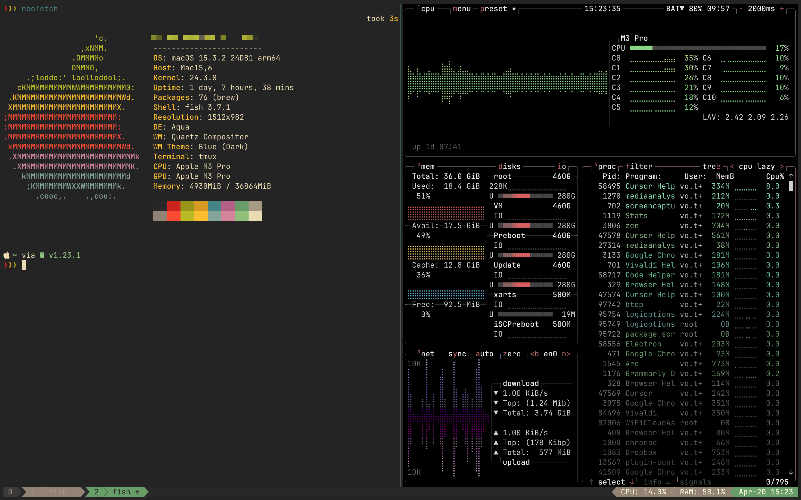

# Dotfiles

Personal dotfiles for macOS and Linux, managed with [GNU Stow](https://www.gnu.org/software/stow/).



## Quick Start

One-liner for a fresh machine (no git/SSH required):

```bash
curl -fsSL https://raw.githubusercontent.com/thorvn/dotfiles/master/meta/bootstrap.sh | bash
```

Or if you already have git:

```bash
git clone https://github.com/thorvn/dotfiles.git ~/.dotfiles
cd ~/.dotfiles
bash meta/install.sh
```

### How Stow Works Here

- **`home/`** is a stow directory with per-tool packages. Each subdirectory is stowed independently: `stow -d home -t $HOME git`
- **`config/`** is a single stow package targeting `~/.config`: `stow --no-folding -t ~/.config config`
- **`archive/`** holds old configs for reference. Never stowed.
- **`meta/`** contains install scripts and non-stowable files.

## Usage

```bash
# Stow everything
make all

# Unstow everything
make uninstall

# Stow/unstow a single home package
make pkg PKG=git
make unpkg PKG=git
```

All stow commands use `-R` (restow) so `make all` is safe to run repeatedly.

`--no-folding` is used for `config/` to prevent stow from symlinking entire directories, so apps can write their own files (such as `lazy-lock.json`) without polluting the repo.

## Components

**Shell & Terminal:**
Zsh, Antidote, Starship, Ghostty, Tmux

**Editor:**
Neovim (LazyVim)

**CLI Tools:**
ripgrep, eza, bat, fzf, zoxide, lazygit, git-delta

**macOS:**
Karabiner-Elements

**Version Management:**
mise

## Local Configuration

The Git file is created by the installer but not tracked by Git. The Zsh
override is optional:

- `~/.gitconfig.local` — personal git user info (name, email)
- `~/.config/zsh/local.zsh` — optional machine-specific Zsh overrides

## Platform Notes

### macOS
- Uses Homebrew for package management
- Uses the system `/bin/zsh` as the login shell
- Karabiner config stowed automatically
- System preferences applied via `meta/scripts/macos_config.sh`

### Linux
- Uses apt on Ubuntu and dnf on Fedora; both install Zsh
- Provisions `en_US.UTF-8` as the login locale and leaves `LC_ALL` unset
- Install scripts in `meta/software/` and `meta/scripts/`

The installer first checks that Zsh starts without user configuration, then
selects it as the login shell. Dotfile linking, pinned Antidote/plugin
provisioning, and a full startup smoke test follow. A failure in those later
steps returns an error without reverting the login shell.

### Locale and tmux

On macOS, the installer validates that the login session provides
`LANG=en_US.UTF-8` with `LC_ALL` unset. If validation fails, update Language &
Region and the terminal's locale settings, then start a new login session before
rerunning the installer. Locale is intentionally not overridden in `.zshrc`.

A tmux server keeps the environment it had when it started. The installer never
terminates an existing server, so old sessions remain safe but do not acquire a
new locale automatically. After saving work and closing any valuable sessions,
restart tmux yourself:

```bash
tmux list-sessions
# Run only after confirming that no valuable session remains:
tmux kill-server
tmux
```

In the new login shell and newly started tmux server, `locale` should report
`LANG=en_US.UTF-8` and no `LC_ALL`. No tmux `-u` alias or forced UTF-8 option is
needed.

## After Bootstrap

Switch the remote to SSH once you have keys set up:

```bash
cd ~/.dotfiles && git remote set-url origin git@github.com:thorvn/dotfiles.git
```
